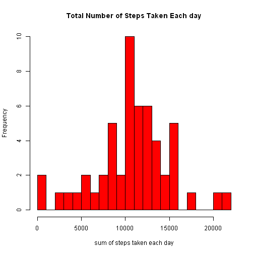
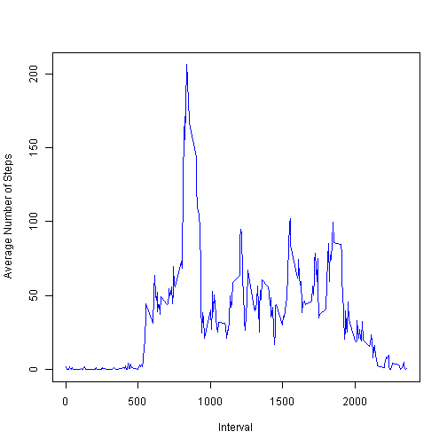
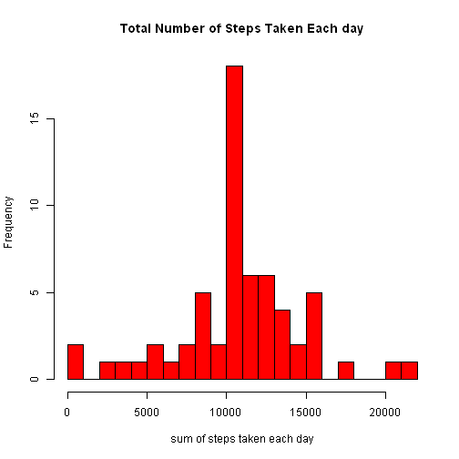
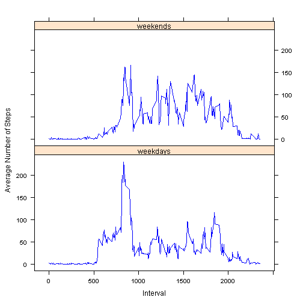

 Reproducible Research: Peer Assessment 1
=========================================================
For this assignment we analysed the [Activity monitoring data](https://d396qusza40orc.cloudfront.net/repdata%2Fdata%2Factivity.zip/) dataset. 

There are three varaibles in the data:

1. steps: Number of steps taking in a 5-minute interval

2. date: The date on which the measurement was taken in YYYY-MM-DD format

3. interval: Identifier for the 5-minute interval in which measurement was taken

The dataset is stored in a comma-separated-value (CSV) file and there are a total of 17,568 observations in this dataset.

overall goal of the assignment is to find the average total number of steps taken each day and see if there is any daily or weekends activity pattern.

###Loading and preprocessing the data

Loaded the data to R.


```r
library(lattice)
# load the data set
data<-read.csv("./activity.csv",header=T)
```

###First part: What is mean total number of steps taken per day?


First I calculated  total number of steps taken per day while ignoring the missing values in the dataset


```r
## Total number of steps taken per day
stepsSum<-aggregate(steps~date,data=data,sum)
```

and then plottted the histogram of total number of steps taken each day.


```r
##histogrm of total number of steps taken each day
hist(stepsSum$steps,col="red",xlab="sum of steps taken each day",ylab= "Frequency", main="Total Number of Steps Taken Each day",breaks=20)
```

 

Calculated the mean and median of the total number of steps taken per day 


```r
## mean and median of total number of steps taken each day
summary<-c(mean(stepsSum$steps),median(stepsSum$steps))
names(summary)<-c("Mean","Median")
summary
```

```
##     Mean   Median 
## 10766.19 10765.00
```

The mean of total number of steps is 10766.19 and median is 10765.00 which is sightly less than mean.

###Second part: What is the average daily activity pattern?

To see the average daily activity pattern a time series plot of the 5-minute interval  and the average number of steps taken, averaged across all days is plotted.

 first I Calculated the average number of steps taken in each interval


```r
## average number of steps taken for each interval across all the days
stepsavg<-aggregate(steps~interval,data=data,mean)
```

and then plotted  a time series plot of the 5-minute interval (x-axis) and the average number of steps taken, averaged across all days (y-axis)


```r
with(stepsavg,plot(interval,steps,col="blue",type="l",xlab="Interval",ylab="Average Number of Steps"))
```

 

The plot shows that the maximum number of steps on average were taken between about 800 and 900 intervals.


The 5-minute interval with maximum numberof steps on average is found below.


```r
stepsavg[stepsavg$steps==max(stepsavg$steps),]
```

```
##     interval    steps
## 104      835 206.1698
```

835th 5-minute interval contains maximum (206.1698) number of steps on average.

###Third part: Imputing missing values

 Calculated the total number of missing values in the dataset


```r
n.missing<-sum(is.na(data$steps))
n.missing
```

```
## [1] 2304
```

There are 2304 missing values in the dataset.


I filled in the missing values with the mean for that 5-minute interval and created a new dataset of same dimensions.


```r
impute <- function (vec, vec.impute){ 
        ifelse (is.na(vec), vec.impute, vec)
}
steps.impute<-rep(stepsavg$steps,length(unique(data$date)))
data2<-data
data2$steps<-impute(data$steps,steps.impute)
#data2
```

To see the impact of  the imputed missing values, I again calculated the  total number of steps taken per day from new data


```r
stepsSum2<-aggregate(steps~date,data=data2,sum)
```

and plotted the histogram of the total number of steps taken each day for new data


```r
hist(stepsSum2$steps,col="red",xlab="sum of steps taken each day",ylab= "Frequency", main="Total Number of Steps Taken Each day",breaks=20)
```

 

The mean and median of the total number of steps taken per day from new data were also calculated


```r
summary<-c(mean(stepsSum2$steps),median(stepsSum2$steps))
names(summary)<-c("Mean","Median")
summary
```

```
##     Mean   Median 
## 10766.19 10766.19
```

From new data,the mean of total number of steps is 10766.19  which is same as in first part and median is also 10766.19 which is slightly higher than in first part of the assignment.


###Fourth part: Are there differences in activity patterns between weekdays and weekends?

A new factor variable in the dataset with two levels - "weekday" and "weekend" indicating whether a given date is a weekday or weekend is created


```r
days<-weekdays(as.Date(data2$date))%in%c("Saturday","Sunday")+1L
data2$dayfactor<-factor(days,levels=1:2,labels=c("weekdays","weekends"))
```

To see the differences in activity patterns between weekdays and week ends, a panel plot containing a time series plot of the 5-minute interval (x-axis) and the average number of steps taken, averaged across all weekday days or weekend days (y-axis) is plotted


```r
## average number of steps taken for each interval across weekdays or weekends
stepsavg2<-aggregate(steps~interval+dayfactor,data=data2,mean)
with(stepsavg2,xyplot(steps~interval|dayfactor,data=stepsavg2,type="l",col="blue",xlab="Interval",ylab="Average Number of Steps",layout=c(1,2)))
```

 

The above plot shows that for most of the  intervals  the average number of steps taken during weekends are more than weekdays. There is more activity during weekends than weekdays.
